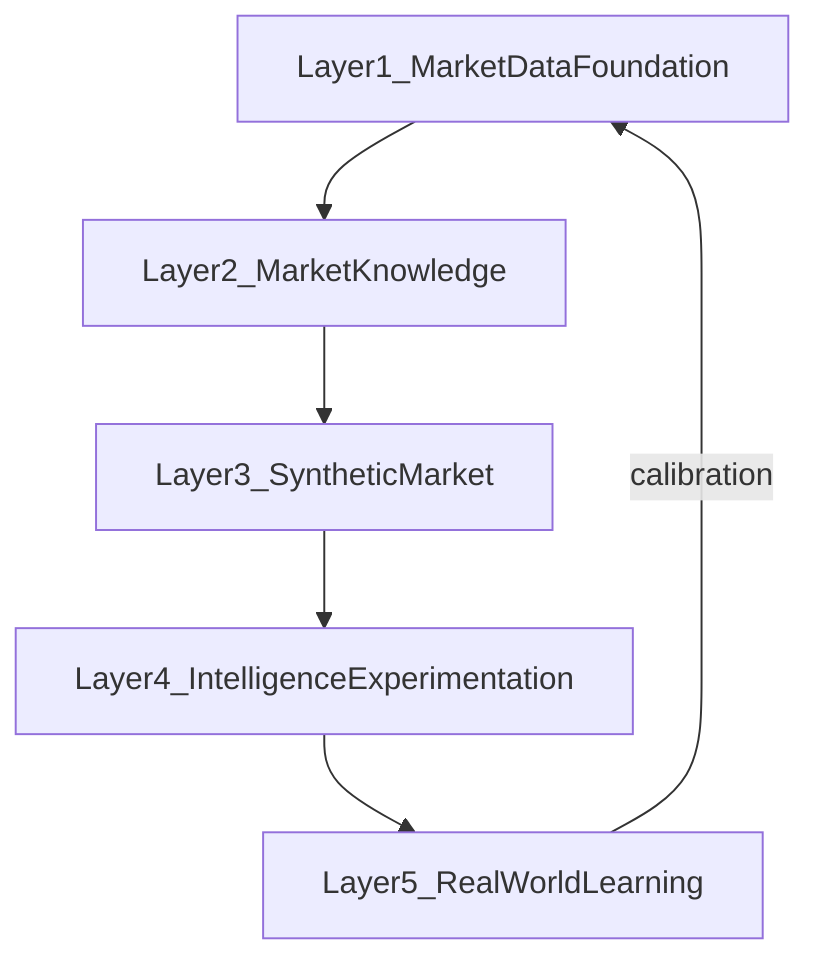
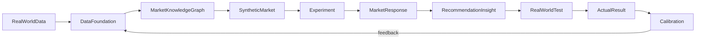

# Architecture

## Five layers

| Layer | Responsibility |
|-------|----------------|
| **1 — Market Data Foundation** | Collect and organize evidence about the real market |
| **2 — Market Knowledge** | Connect businesses, consumers, products, prices, needs, locations, behaviors, economic conditions |
| **3 — Synthetic Market** | Create representative consumer populations and market actors from evidence |
| **4 — Intelligence & Experimentation** | Ask questions, test concepts, simulate scenarios |
| **5 — Real-World Learning** | Compare hypotheses against outcomes; continuously improve |

## Intelligence loop

## Subsystem map

| Subsystem | Owns |
|-----------|------|
| Ingestion | Sources → normalize → provenance → store |
| Knowledge Graph | Entities, relationships, history, geography |
| Evidence Store | Raw + classified observations (not premature scores) |
| Need Graph | Problem → outcome → alternatives → barriers |
| Price Intelligence | List/promo/history/regional/transactional prices |
| Synthetic Population | Agents grounded in market evidence |
| Experiment Engine | Baseline + counterfactuals, controlled variables |
| Confidence & Labels | OBSERVED / REPORTED / INFERRED / SIMULATED / PREDICTED |
| Calibration | Sim vs actual deltas, segment/model error analysis |
| UX / API | Natural-language intent + experiment workspace + dashboards |

## Open-source engines (pluggable, not infrastructure)

Evaluate and integrate ideas/components from:

| Project | Useful for |
|---------|------------|
| **GenAgents** | Individual agents, profiles, memory, longitudinal context |
| **DeepPersona** | Persona generation, demographic/consumer research structures |
| **AgentTorch** | Population-level agent simulation |

These are **engines plugged into** the platform — not the platform itself. Our architecture remains independent.

## Product surfaces (by phase maturity)

### Simple entry UX

> What are you trying to understand?

System identifies industry, geography, population, competition, pricing, needs, economic environment — then asks only for missing information.

### Experiment workspace

- **BASELINE** — product, price, duration, location  
- Duplicate into VERSION B/C/D with controlled variable changes  
- Compare scenarios

### Output dashboard (targets)

| Panel | Content |
|-------|---------|
| Market | Size indicators, geography, competitive landscape |
| Consumer | Segments, needs, alternatives |
| Product | Concept fit, objections |
| Price | WTP concepts, sensitivity |
| Competition | Alternatives, switching factors |
| Opportunity | Unmet needs, gaps |
| Time | Preference durability, changing conditions |
| Evidence | Sources, confidence |
| Experiments | Scenario comparisons |

### Market Opportunity Map (later)

Canada → Province → City → Neighborhood with need intensity, supply, competition, pricing, segments, gaps, business/demand density.

## Design principles

1. **Evidence before simulation** — never skip the market foundation.  
2. **Retain original evidence** — do not collapse everything to a sentiment score.  
3. **Needs are first-class** — not only “do they like it?”  
4. **Rejection ≠ lack of demand** — distinguish “I don’t need it” from “I need it, but not like this.”  
5. **Label every output** — OBSERVED / REPORTED / INFERRED / SIMULATED / PREDICTED.  
6. **History is intelligence** — preserve price/product/location timelines.  
7. **Synthetic = population statistics** — not impersonation of identifiable individuals.  
8. **Private by default** where appropriate; strict tenant isolation for proprietary data.  
9. **Calibration is an asset** — store every sim-vs-actual delta.  
10. **Industry-agnostic core** — vertical packs are configuration/data, not forks.
