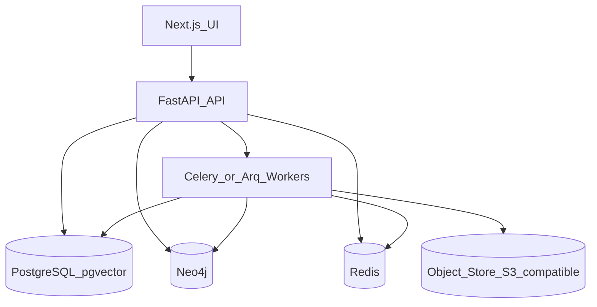

# Tech Stack Recommendation

**Decision:** Python-first platform with FastAPI services, PostgreSQL (+ pgvector), Neo4j knowledge graph, Redis workers, and a Next.js experiment UI.

This is the recommended default for a greenfield AI-native Market Twin. Stack choices optimize for (1) data/agent ecosystem fit, (2) knowledge-graph + evidence retrieval, (3) long-term calibration/experiment workloads, and (4) a usable product surface without locking monetization to one model.

## Why this stack

| Requirement | Implication |
|-------------|-------------|
| GenAgents / DeepPersona / AgentTorch and similar | **Python** is the native ecosystem |
| Continuous ingestion + normalization | Python data tooling (pandas, pydantic, connectors) |
| Market Knowledge Graph + Need Graph | Dedicated **graph DB** (Neo4j) plus relational system of record |
| Evidence / semantic search | **pgvector** (or later dedicated vector store) |
| Experiment + calibration history | Strong relational OLTP + append-only event/history tables |
| Product UX (intent → workspace → dashboard) | **Next.js** TypeScript frontend |
| Multi-tenant private data | Postgres RLS + app-level ACLs + audit log |
| API product later | FastAPI OpenAPI-first from day one |

TypeScript-only fullstack was rejected as primary backend because synthetic-population and agent-simulation ecosystems are Python-dominant; forcing those into Node increases integration cost for Phase 3+.

## Recommended components

| Layer | Choice | Role |
|-------|--------|------|
| API | **FastAPI** + Pydantic v2 | HTTP/API, auth, experiment orchestration |
| Workers | **Arq** or **Celery** + Redis | Ingestion, NLP extraction, simulation jobs |
| System of record | **PostgreSQL 16** | Entities, history, experiments, calibration, tenancy |
| Vectors | **pgvector** | Evidence embeddings, semantic retrieval |
| Knowledge graph | **Neo4j** | Market / need / competitor relationships, geo hierarchy queries |
| Object storage | S3-compatible | Raw source snapshots, licenses, large artifacts |
| Cache / queue | **Redis** | Job queue, rate limits, session cache |
| Frontend | **Next.js** (App Router) + TypeScript | Intent UX, experiment workspace, dashboards |
| Auth (early) | Auth.js / Clerk / similar + API JWT | Users, orgs, roles |
| Observability | OpenTelemetry + structured logs | Lineage-friendly ops |
| IaC / deploy (later) | Docker Compose → Kubernetes | Local → cloud path |
| LLM gateway | Provider-agnostic adapter (OpenAI/Anthropic/local) | Extraction, reasoning, labeled as INFERRED/SIMULATED |

## Data store split (important)

| Store | What belongs there |
|-------|--------------------|
| **Postgres** | Canonical records, source registry, provenance, confidence scores, price history tables, experiment definitions/results, calibration outcomes, tenancy, audit |
| **Neo4j** | Relationship-heavy navigation: geo hierarchy, competitor-of, satisfies-need, alternative-to, located-in, sells-product |
| **Object store** | Immutable raw dumps, PDFs, scrape archives, license docs |
| **Redis** | Ephemeral job/state only — not source of truth |

Do **not** put the only copy of business-critical facts solely in the graph. Graph is a derived/serving layer keyed to Postgres IDs.

## Local development baseline

1. Docker Compose: Postgres (+ pgvector), Neo4j, Redis, MinIO  
2. `apps/api` — FastAPI  
3. `apps/web` — Next.js  
4. `packages/schemas` — shared Pydantic / JSON Schema for evidence labels  
5. `workers/` — ingestion + simulation jobs  
6. Seed pack: GTA automotive services synthetic/demo data (clearly labeled)

## Alternatives considered

| Alternative | Why not primary |
|-------------|-----------------|
| TypeScript fullstack only | Weak fit for agent/population sim libraries |
| Graph-only (Neo4j alone) | Weak for tenancy, calibration SQL, financial/price history analytics |
| Postgres-only graph (AGE) | Viable later cost optimization; Neo4j is clearer for Phase 1–2 graph work |
| Heavy data warehouse first | Premature; start OLTP + history tables; warehouse when volume demands |

## Non-goals for stack Phase 1

- Multi-region active-active  
- Real-time streaming as default (batch + incremental first)  
- Training custom foundation models  
- Shipping GenAgents/AgentTorch as the product surface
