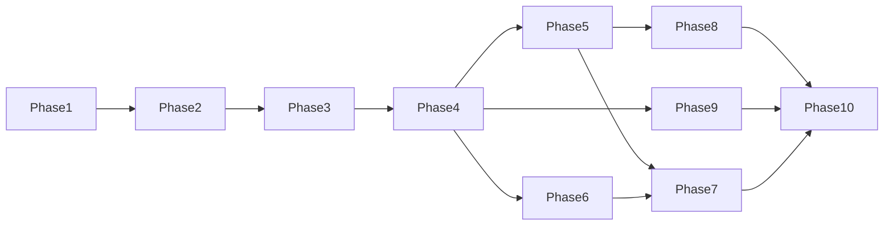

# Roadmap & Epics

Ten development phases from the Market Twin business model, broken into **epics** and **GitHub-ready issues**.

**Initial market:** GTA · **Seed vertical:** automotive services · **Stack:** see [TECH_STACK.md](../TECH_STACK.md)

## Phase index

| Phase | Name | Goal |
|------:|------|------|
| [1](phase-01-foundation.md) | Foundation | Sources → ingestion → normalization → graph → provenance → history → confidence → API |
| [2](phase-02-market-representation.md) | Market Representation | One high-quality GTA market representation |
| [3](phase-03-synthetic-population.md) | Synthetic Population | Pluggable agents (GenAgents / DeepPersona / AgentTorch ideas) |
| [4](phase-04-basic-experimentation.md) | Basic Experimentation | Product + Price + Location + Consumer experiments |
| [5](phase-05-needs-intelligence.md) | Needs Intelligence | Needs, alternatives, barriers, rejection reasons |
| [6](phase-06-price-intelligence.md) | Price Intelligence | WTP concepts, sensitivity, pricing scenarios |
| [7](phase-07-temporal-behavior.md) | Temporal Behavior | Preference duration, retention, switching |
| [8](phase-08-discovery.md) | Discovery | MARKET → IDEA opportunity surfacing |
| [9](phase-09-calibration.md) | Real-World Calibration | Sim vs actual loop and calibration DB |
| [10](phase-10-market-twin.md) | Market Twin | Unified continuously evolving market representation |

## Issue conventions

Each issue below is written so it can be pasted into GitHub Issues.

**Labels (suggested):** `phase-N`, `epic:<slug>`, `type:feature|chore|docs|infra`, `area:api|web|data|graph|sim|ux`, `priority:P0|P1|P2`

**Definition of done (global):**

- Schema/API documented  
- Tests for happy path + provenance/label requirements where applicable  
- No unlabeled SIMULATED/PREDICTED outputs in UI/API  
- Private tenant data cannot leak into public datasets  

## Dependency overview

